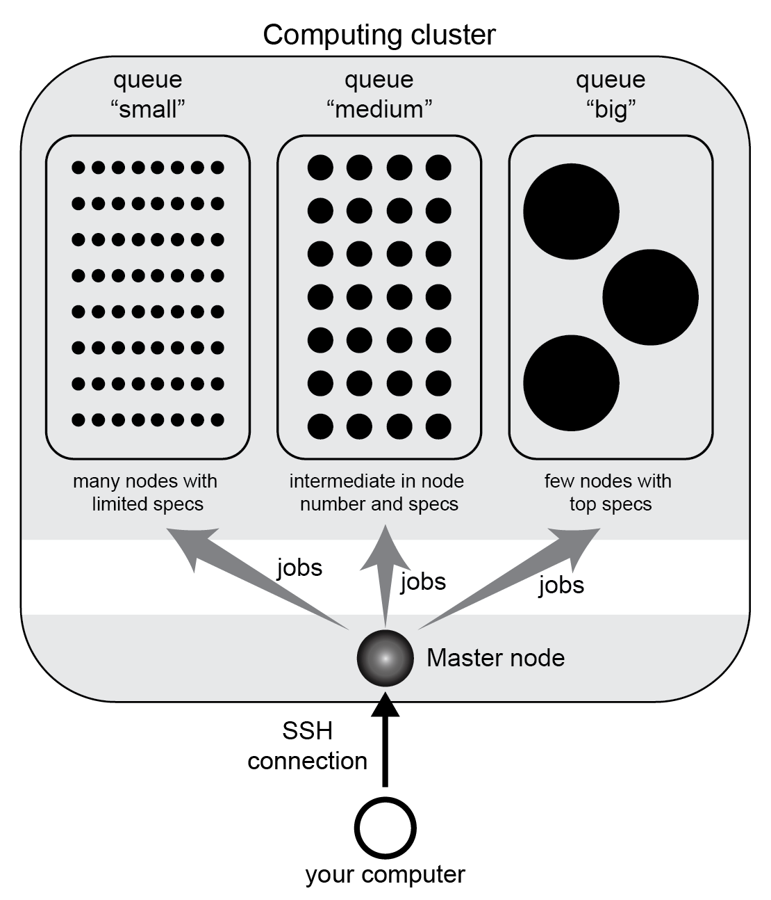

Tutorial of qjob
================

.. contents:: Contents of Tutorial
   :depth: 3

Introduction to computing clusters and queueing systems
-------------------------------------------------------

A *cluster* is a computational infrastructure consisting of a multitude of computers
(called *nodes*) connected in a network. A cluster may contain hundreds or thousands
of nodes, widely ranging in characteristics: from small computers with few CPUs,
to powerful ones with huge amounts of memory. Typically, all computers have access
to a shared file system, meaning that they can read and write the same disk.

The main purpose is a cluster is offering users a platform to execute calculations,
and its main power is parallel computing. Users split their total computational
workload in bits called jobs, and sends them to the cluster for execution.

Clusters come with *queueing systems* (also known as job scheduler, batch system,
DRMS, DRM, workload automation), which facilitate distributing jobs.
Thanks to this, users don't have to manually connect to single
nodes to run calculation. Instead, they connect and operate uniquely within a "master"
node. From here, users can run dedicated commands to send jobs to be computed (i.e.,
submit them).

When submitting a job, the user has to specify its resource requirements: total time
of execution, memory, and number of threads. These are **upper limits** which are
typically strictly enforced: if a job uses more memory or run for longer than
specified, it is killed.

Besides, the user must choose a specific *queue* for job submission. Queues are set
by the system administrator and differ among clusters. Typically, you have different
queues corresponding to different resource requirements, e.g. you may have a queue
dedicated to everyday jobs with short runtime and little memory, and another for big
jobs requiring long runtimes and lots of memory.

	   
   Scheme of an computing cluster example with three queues.

Once jobs are submitted, the system takes care of finding a suitable node for each.
If there isn't any available at the moment, jobs are queued (i.e., put on a waiting
list) until resources free up.

Before you start using a cluster, make sure you know:

  - its queue names and guidelines
  - which queueing system is installed

The most popular queueing systems used are two: Sun Oracle Engine (SGE, also known as Oracle
Grid Engine) and Slurm Workload Manager (Slurm). Both are supported by qjob. They are roughly
equivalent in functionalities, but use separate commands. For job submission, SGE provides the
command ``qsub``, whereas Slurm uses ``sbatch``. If you're unsure which system you have, check
which of these two commands are available in your shell.

(Note: cloud computing is conceptually analogous to huge computing clusters, owned
by a tech company which rents them to users. However, cloud computing services
use distinct and platform-specific queueing systems, so that qjob is not compatible with them.)

Monitor job status and cluster usage
------------------------------------
Before you start to submit jobs to a cluster, it is important to know the essential commands
to monitor its current usage, and the status of jobs. These utilities depends on the queueing systems.

In **SGE**, you have:
  
  - ``qstat`` to see the status of your jobs (empty output if there are none)
  - ``qstat -a "*"`` to see jobs of all users
  - ``qstat -g c`` to see a summary of the cluster usage, split by queue

In **Slurm**, you have:
  
  - ``squeue -u $USER`` to see the status of your jobs
  - ``squeue`` to see jobs of all users
  - ``sview`` for a convenient interactive interface with cluster usage and job status

These programs implement numerous options, and queueing systems also include additional
command utilities. Check the documentation and tutorials of SGE and Slurm online for more details.

Aim and usage of qjob
----------------------

Qjob comes into play when you have a bunch of commands to be computed, i.e., a "workload",
consisting of a series of commands such as this ``analysis1_workload.sh`` file ::

	   run_analysis -i file_A -n 50 -o output_A > logs/log_file_A
	   run_analysis -i file_B -n 50 -o output_B > logs/log_file_B
	   run_analysis -i file_C -n 50 -o output_C > logs/log_file_C
	   run_analysis -i file_D -n 50 -o output_D > logs/log_file_D
	   run_analysis -i file_E -n 50 -o output_E > logs/log_file_E
	   run_analysis -i file_F -n 50 -o output_F > logs/log_file_F
	   run_analysis -i file_G -n 50 -o output_G > logs/log_file_G
	   run_analysis -i file_H -n 50 -o output_H > logs/log_file_H
	   run_analysis -i file_I -n 50 -o output_I > logs/log_file_I
	   run_analysis -i file_J -n 50 -o output_J > logs/log_file_J
	   run_analysis -i file_K -n 50 -o output_K > logs/log_file_K
	   run_analysis -i file_L -n 50 -o output_L > logs/log_file_L
	   run_analysis -i file_M -n 50 -o output_M > logs/log_file_M

**The aim of qjob is to simplify splitting the workload into jobs, define job specifications,
and submit them for computation**.

There are many possible ways to split the workload into jobs. The example file above 
has 13 lines. We may decide to submit them as a single job: this means they'll all
be computed sequentially on the same computer. Or we may submit them as 13 jobs of one line each. Or anything in between.
Depending on the workload, on the cluster features, and on its usage status,
you may want to go one way or another. 

Let's say that we want to split in three jobs, corresponding to option ``-nj 3``
(*-nj* stands for *number of jobs*). Then, you execute::

       qjob -i analysis1_workload.sh -nj 3

       
After running qjob, you should see it created a *jbs* folder called ``analysis1_workload.sh.jbs/``,
with three files::

     analysis1_workload.sh.1  analysis1_workload.sh.2  analysis1_workload.sh.3

The command lines in ``analysis1_workload.sh`` have been partitioned to three *job* files.
But also, these files contain essential job specs required at time of submission.
For example let's inspect ``analysis1_workload.sh.jbs/analysis1_workload.sh.1``::

    #!/bin/bash
    #$ -S /bin/bash
    #$ -cwd
    #$ -M marco.mariotti@ub.edu
    #$ -q my_queue_1
    #$ -l h_rt=6:0:00
    #$ -m a
    #$ -V
    #$ -N analysis1_workload.sh.1
    #$ -l virtual_free=7G
    #$ -e /home/mmariotti/my_analysis/analysis1_workload.sh.jbs/analysis1_workload.sh.1.ERR
    #$ -o /home/mmariotti/my_analysis/analysis1_workload.sh.jbs/analysis1_workload.sh.1.LOG
    run_analysis -i file_A -n 50 -o output_A > logs/log_file_A
    run_analysis -i file_B -n 50 -o output_B > logs/log_file_B
    run_analysis -i file_C -n 50 -o output_C > logs/log_file_C
    run_analysis -i file_D -n 50 -o output_D > logs/log_file_D
    run_analysis -i file_E -n 50 -o output_E > logs/log_file_E

*Note, this file was built on a SGE system. The corresponding file for Slurm would be similar.*
    
Besides the 5 command lines at the bottom, the file contains parameters (queue name, time limit etc)
which will be read by the job submission utility (``qsub`` for SGE, ``sbatch`` for Slurm).
In this case, all parameters were defined by the user default settings of qjob.

Note that the jobs were not submitted just yet. To do this, you would have to re-run the same
qjob command as before, adding option ``-Q``::

       qjob -i analysis1_workload.sh -nj 3 -Q

If the *jbs* folder was already created by a previous run (like in our case here), the user will be
prompted for overwrite confirmation. Then, job files will be created like before, then submitted.

**Note**: before submitting lots of jobs, it is a good practice to always inspect your commands.
It is also a good idea to test interactively at least one command line, to avoid trivial spelling mistakes.
If the command seems to start running ok in the master node, you can terminate it (Ctrl+C), and finally submit
the workload using qjob as shown above.

Job specifications and other options
------------------------------------

To specify any non-default parameters, use qjob command line options.
**Job specifications** are particularly important. You typically want to specify:

    - option ``-q`` = queue name
    - option ``-m`` = memory requested in GB
    - option ``-t`` = time limit in hours
    - option ``-p`` = number of processors requested

Another few commonly used options are presented hereafter.

Both the output folder and the job *name* are normally derived from the input file name,
but they may be specified with options ``-o`` and ``-n``, respectively. The job name is derived
from output folder when not specified explicitly.

By default, qjob redirects the standard output and error of each job (i.e., of all commands
within the job which aren't redirected already) to .LOG and .ERR files located inside the
*jbs* folder. Two options can alter this. Option ``-joe`` joins output and error, so every
job writes to a single file; and option ``-sl`` joins the output of all jobs of the workload.

In the most typical use of qjob, you specify the desired number of jobs, and the program will
split the input workload into groups of lines accordingly. However, you can instead decide how many
command lines you want per job, using option ``-nl``.

Qjob provides plenty of other options for customizing behavior. Run::
  
  qjob -h full

to see the complete list of options.

Default qjob options
--------------------

The configuration file in your home folder ``~/.qjob`` contains the default options
for your user. You can open this file and modify it with any text editor. Modifications
will take effect in the next qjob run.
As explained in :doc:`installation`, this file is created at your first use of qjob,
when you run ``qjob -setup``.

Direct mode vs template mode
----------------------------

Qjob has two main modalities. We have seen the first one above, called *direct mode*.
The user directly provides a file with the commands that will be executed in the nodes
with option ``-i``::

  qjob -i analysis1_workload.sh
  
Alternatively, the user can choose the *template mode*:

  - a template command is provided with ``-c``. This text includes placeholders marking the parts where
    command lines must differ, e.g. different input files are processed.
  - a tab-separated table is provided with ``-d``, which contains the data to replace the
    placeholders, therefore expanding the template to the full workload. 

Let's see an example in template mode equivalent to the direct mode example used before.
Here's the template file ``analysis1_template.sh``::

  run_analysis -i {input} -n 50 -o {output} > logs/{log}

And the data table file ``analysis1_data.tsv``  (all delimiters are tabulators)::
  
  input	output	log
  file_A	output_A	log_file_A
  file_B	output_B	log_file_B
  file_C	output_C	log_file_C
  file_D	output_D	log_file_D
  file_E	output_E	log_file_E
  file_F	output_F	log_file_F
  file_G	output_G	log_file_G
  file_H	output_H	log_file_H
  file_I	output_I	log_file_I
  file_J	output_J	log_file_J
  file_K	output_K	log_file_K
  file_L	output_L	log_file_L
  file_M	output_M	log_file_M

You may run qjob with::

  qjob -c analysis1_template.sh -d analysis1_data.tsv  -nj 3

Which will produce a *jbs* folder with files identical to the example previously presented.

**Note**, howewer, that in template mode the output folder name (and job name) is derived
from the template provided, which may not necessarily uniquely identify the workload.
Thus, in template mode, it is recommended to explicitly provide an output folder with option ``-o``.

Parallel vs sequential execution
--------------------------------

*Jobs* are distributed to different nodes, and run (at least potentially) in parallel.
What if your calculations have some sequential dependencies, e.g. a first part generating
the data for a second part? In the following example, the second line must be executed only
after the first one has finished, same for the fourth after the third.
::
   
   run_part1 -i inputA    -o midfileA
   run_part2 -i midfileA  -o outputA
   run_part1 -i inputB    -o midfileB
   run_part2 -i midfileB  -o outputB
   
   
In *direct mode*, **it is assumed that each line of the input workload (option** ``-i``
**) can be executed in parallel to others**. So, if you use the workload shown above and
you're not careful about how you split it into jobs, you may end up messing up the
execution order.

There are various possibilities for encoding sequential execution in qjob.
The recommended one is to modify your input workload to avoid violating the assumption
above. Input commands may be arbitrarily complex, so you may chain multiple program
execution in each line through standard command separators.
Therefore, the simplest solution is to use semicolons "``;``" to chain into the same line
those commands that must be executed sequentially::

     run_part1 -i inputA  -o midfileA; run_part2 -i midfileA  -o outputA
     run_part1 -i inputB  -o midfileB; run_part2 -i midfileB  -o outputB

There is one variant which is a bit more robust to errors. When using semicolons "``;``",
the second part is run even if the first part has crashed. To prevent this, you can use
the double ampersand "``&&``". This command separator indicates that the next command will be
run only if the previous one had a non-error exit-status (the value ``0``). Naturally, this
is feasible only when the programs employed correctly set their exit status (not always the case!).

::
   
   run_part1 -i inputA  -o midfileA && run_part2 -i midfileA  -o outputA
   run_part1 -i inputB  -o midfileB && run_part2 -i midfileB  -o outputB

   
This strategy (with ``;`` or ``&&``) works both in direct and template mode. In template mode,
however, you may actually leave commands as separate lines, and they will be still executed sequentially.
This is because a template command is never broken into smaller jobs: at most, one job will contain
one template instance. In other words, in template mode, each template is treated like single
line are treated in direct mode. So, these two templates are functionally equivalent::

  run_part1 -i {input}  -o {mid};  run_part2 -i {mid}    -o {out}

::
   
  run_part1 -i {input}  -o {mid}
  run_part2 -i {mid}    -o {out}
     

If your calculations require more complex dependencies (e.g. several split-apply-combine steps are chained),
then you must adopt a more powerful workload manager than qjob. We recommend `Nextflow <https://www.nextflow.io/>`_.

